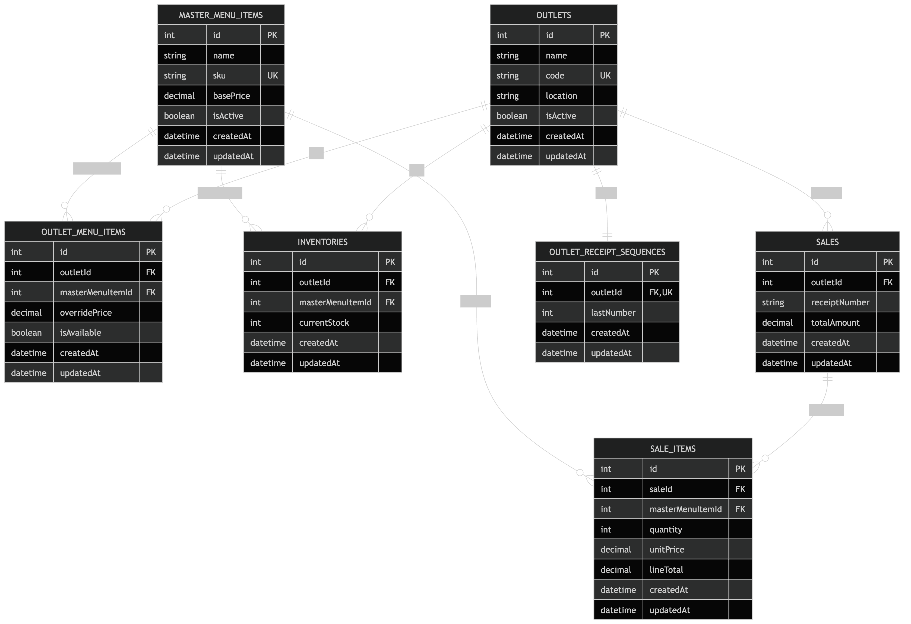

# Architecture Documentation

## 1. Purpose

This document describes the current backend POS architecture and explains how it can evolve to support larger operational scale, microservices, and offline-first outlet operation.

The current implementation is a modular monolith built with Express, TypeScript, Sequelize, and PostgreSQL. For the assessment scope, that is an appropriate choice because it keeps the design simple while still enforcing the core business rules:

- outlet-specific menu configuration
- outlet-specific inventory
- transactional sale creation
- per-outlet sequential receipt numbering
- outlet and HQ reporting

## 2. Current System Overview

### 2.1 Architectural Style

The system currently follows a layered monolith architecture:

```text
Client/API Consumer
        |
     Express Router
        |
    Controller Layer
        |
     Service Layer
        |
   Repository Layer
        |
 PostgreSQL via Sequelize
```

This design is suitable for the current scope because:

- all business logic is centralized in one deployable service
- transaction boundaries are easy to manage
- development and testing remain straightforward

### 2.2 Current Functional Modules

The existing codebase already maps cleanly into business capabilities:

- Menu Management: `master_menu_items`
- Outlet Management: `outlets`
- Outlet Menu Assignment: `outlet_menu_items`
- Inventory Management: `inventories`
- Sales Processing: `sales`, `sale_items`, `outlet_receipt_sequences`
- Reporting: revenue and top-item aggregation from sales data

## 3. ERD Diagram

Standalone ERD link: [erd-diagram.png](./erd-diagram.png)



### 3.2 Relationship Notes

- One `outlet` can have many `outlet_menu_items`.
- One `master_menu_item` can be assigned to many outlets through `outlet_menu_items`.
- `outlet_menu_items` acts as the outlet-level sellability and pricing configuration table.
- `inventories` tracks stock per `(outletId, masterMenuItemId)`.
- One `outlet` has many `sales`.
- One `sale` has many `sale_items`.
- `sale_items` stores the price charged at the moment of sale, which preserves historical accuracy even if base or override prices change later.
- `outlet_receipt_sequences` stores one receipt counter per outlet to guarantee sequential outlet-scoped receipt numbers.

### 3.3 Important Constraints

- `outlets.code` is unique.
- `master_menu_items.sku` is unique.
- `outlet_menu_items` is unique on `(outletId, masterMenuItemId)`.
- `inventories` is unique on `(outletId, masterMenuItemId)`.
- `sales` is unique on `(outletId, receiptNumber)`.
- `outlet_receipt_sequences.outletId` is unique.

These constraints are important because they prevent duplicate outlet assignments, duplicate inventory records, and duplicate outlet receipts.

## 4. Transaction Flow and Consistency

The most important write path is sale creation.

Current behavior:

1. Validate the outlet exists.
2. Validate that each requested item is assigned to the outlet.
3. Lock the corresponding inventory rows.
4. Reject the request if stock is insufficient.
5. Deduct inventory in the same database transaction.
6. Increment the outlet receipt sequence in the same transaction.
7. Create `sales` and `sale_items` in the same transaction.

This is a strong design choice for the current phase because it provides atomicity. A sale is either fully committed with stock deduction and receipt generation, or it is fully rolled back.

## 5. Scaling Plan for 10 Outlets and 100,000 Transactions per Month

### 5.1 Scale Assumption

The requested target is 10 outlets and 100,000 transactions per month.

That volume is still moderate for PostgreSQL, especially for a normalized POS schema. On average, this is roughly:

- around 10,000 transactions per outlet per month
- around 3,300 transactions per day across all outlets, assuming 30 days
- roughly 140 transactions per hour on average across the whole estate

Real POS traffic will not be evenly distributed, so the architecture should be designed for peak meal-time bursts rather than simple monthly averages.

### 5.2 Database Scaling Strategies

For this scale, PostgreSQL can continue to be the system of record, but the schema and access patterns should mature.

Recommended evolution:

1. Add targeted indexes for high-volume access paths.
   - `sales(outletId, createdAt)`
   - `sales(createdAt)`
   - `sale_items(saleId)`
   - `sale_items(masterMenuItemId)`
   - `inventories(outletId, masterMenuItemId)` already exists and should remain
   - `outlet_menu_items(outletId, masterMenuItemId)` already exists and should remain

2. Reduce unnecessary query repetition in the sale flow.
   - The current implementation fetches outlet menu data repeatedly while processing a sale.
   - At higher throughput, this should be replaced with a single preloaded item/pricing map inside the transaction.

3. Use connection pooling and tune pool size by workload.
   - Each application instance should use a bounded PostgreSQL pool.
   - Pool size should be sized against database CPU, not maximized blindly.

4. Partition large transactional tables when volume grows.
   - `sales` and possibly `sale_items` can be partitioned by month or by date range.
   - This improves archival, maintenance, and reporting query efficiency.

5. Add read replicas for reporting workloads.
   - OLTP sale writes should remain on the primary database.
   - Heavy read/report traffic can be redirected to replicas to reduce contention.

6. Plan backup, retention, and archival.
   - Historical sales data should be retained for finance and audit.
   - Older partitions can be archived without affecting recent POS traffic.

### 5.3 Reporting Performance Considerations

Reporting becomes the first likely bottleneck before core transaction processing does.

Reasons:

- reports aggregate across many sales rows
- top-item queries join `sales`, `sale_items`, and `master_menu_items`
- HQ dashboards often create repeated read spikes during business hours

Recommended reporting strategy:

1. Separate transactional and analytical workloads.
   - Keep sale creation on the primary write database.
   - Run reporting queries on a read replica or reporting database.

2. Introduce summary tables or materialized views.
   - Daily revenue by outlet
   - Daily quantity sold by outlet and item
   - Monthly rollups for management dashboards

3. Use asynchronous aggregation.
   - Instead of recalculating lifetime totals from raw transactions every time, publish sales events and update reporting tables in the background.

4. Define freshness targets.
   - POS transaction APIs require immediate consistency.
   - Management reporting can usually tolerate slight delay, for example 30 to 120 seconds.

5. Add pagination and explicit reporting scopes.
   - Large multi-outlet reports should avoid loading unbounded datasets in a single request.

### 5.4 Infrastructure Considerations

For 10 outlets and 100,000 transactions per month, the infrastructure can remain relatively lean, but it should no longer be single-instance by design.

Recommended evolution:

1. Containerized deployment behind a load balancer.
   - Run multiple stateless API instances.
   - Route traffic through load balancer or reverse proxy.

2. Central managed PostgreSQL.
   - Use automated backups, failover support, and monitoring.

3. Caching for reference data.
   - Frequently read but infrequently changed data such as outlet metadata and menu catalog can be cached with Redis.
   - Inventory should not rely on stale cache for authoritative stock deduction.

4. Queue/event backbone.
   - Use a message broker or durable queue for async reporting updates, notifications, and later microservice integration.

5. Security and resilience.
   - API authentication and authorization
   - Secret management
   - Health checks and auto-restart
   - Rate limiting for non-POS administrative APIs

### 5.5 Architectural Evolution at This Scale

A practical architecture journey would be:

1. Current state: modular monolith with one PostgreSQL database.
2. Near-term hardening:
   - indexes
   - better query efficiency
   - containerized deployment
   - monitoring
3. Scale-ready monolith:
   - multiple stateless API instances
   - managed PostgreSQL
   - read replica for reporting
   - Redis for cache
   - background workers for aggregation

This is the most defensible recommendation because 100,000 monthly transactions does not justify premature microservice complexity by itself.

## 6. Conversion to Microservices

### 6.1 When Microservices Become Justified

The system should move to microservices only when there is a clear need such as:

- independent scaling of specific workloads
- separate deployment cadence for different domains
- multiple teams owning different business capabilities

For the current implementation, a modular monolith is the right starting point. The code already has meaningful service/repository boundaries, which makes future extraction easier.

### 6.2 Candidate Services

A sensible future microservice split would be:

1. Catalog Service
   - owns `master_menu_items`
   - manages global item definitions, SKU, base price, active status

2. Outlet Configuration Service
   - owns `outlets` and `outlet_menu_items`
   - manages outlet profile, item assignment, outlet pricing, availability

3. Inventory Service
   - owns `inventories`
   - manages stock adjustments, stock reservations, stock audit trail

4. Sales Service
   - owns `sales`, `sale_items`, `outlet_receipt_sequences`
   - handles checkout, receipt generation, transactional sale persistence

5. Reporting Service
   - owns denormalized reporting projections
   - serves dashboards, summary queries, and analytics endpoints

6. Sync/Offline Service
   - handles terminal synchronization, outbound event ingestion, replay, and reconciliation

### 6.3 Why These Components Should Be Separated

- Catalog changes are relatively low frequency and broadly shared.
- Inventory requires strong consistency and operational controls.
- Sales is latency-sensitive and directly tied to POS checkout.
- Reporting has different performance characteristics and is read-heavy.
- Offline sync introduces retry, ordering, reconciliation, and conflict-management concerns that are usually better isolated from the core synchronous API.

Recommended path:

1. Keep the monolith as the source of truth.
2. Introduce domain events, for example `sale.completed`, `inventory.adjusted`, `menu.updated`.
3. Build a reporting projection service first.
   - This is usually the safest extraction because it is read-oriented and less transactionally sensitive.
4. Extract inventory or catalog next if scaling or ownership requires it.
5. Extract sales last, because checkout is the most consistency-sensitive flow.

## 7. Offline POS Mode Strategy

### 7.1 Problem Statement

A real POS environment must continue to operate even when the outlet internet connection to HQ is unavailable.

During offline mode:

- POS terminals should still be able to create sales
- local KDS should still receive kitchen orders
- inventory and receipts must remain usable locally
- HQ synchronization should resume when connectivity returns

### 7.2 Recommended Offline Architecture

Each outlet should have a local outlet runtime, which can be implemented as:

- a small local edge server in the outlet, or
- one terminal elected as the local sync host, though a dedicated edge device is better

Recommended topology:

```text
POS Terminal(s) <-> Local Outlet Server <-> KDS Screen(s)
                         |
                  Sync to HQ when online
```

In this model:

- POS and KDS communicate over the local outlet network
- the outlet server stores local transactions durably
- HQ receives synchronized data when internet connectivity returns

### 7.3 How Offline Sales Sync to HQ After Reconnection

The safest strategy is event-based synchronization with idempotency.

Recommended approach:

1. Each local sale gets a globally unique client-generated identifier such as UUID.
2. The outlet server stores the sale in a local database with sync status:
   - `pending`
   - `synced`
   - `failed`
3. When internet reconnects, the outlet server pushes unsynced sales to HQ in order.
4. HQ processes the event idempotently.
5. The outlet server marks the record as `synced`.

This design is robust because retries become safe and network interruptions do not create duplicate sales.

### 7.4 Conflict and Consistency Strategy

Offline mode means central inventory cannot be perfectly real-time across outlets. The system should therefore define clear consistency rules.

Recommended rules:

1. Inventory is authoritative at the outlet level during offline mode.
   - Outlet A only needs its own stock to continue selling.

2. HQ becomes eventually consistent during the outage.
   - Central dashboards may lag until sync completes.

3. Receipt numbers should be generated locally with outlet-scoped sequencing.
   - Since receipt numbers are already outlet-scoped in the current design, this is a strong fit for offline operation.

4. Sync payloads should include:
   - outlet identifier
   - local sale UUID
   - receipt number
   - business timestamp
   - sale lines
   - payment summary
   - sync metadata

5. Reconciliation jobs should detect:
   - missing acknowledgements
   - duplicate submissions
   - stock anomalies after delayed sync

### 7.5 Ensuring POS and KDS Continue to Work Offline

POS and KDS should communicate through the outlet-local network rather than relying on HQ connectivity.

Recommended mechanism:

1. POS submits the order to the local outlet server.
2. The local outlet server persists the sale/order locally first.
3. The local outlet server publishes the kitchen ticket locally to the KDS.
4. KDS acknowledges local receipt.
5. If HQ is offline, the order still progresses because POS and KDS depend only on the local network.

This is important because internet failure and outlet LAN failure are different failure modes. A well-designed outlet can survive HQ disconnection as long as local connectivity remains available.

### 7.6 Communication Options Between POS and KDS in Offline Mode

Suitable local communication options:

- HTTP over local LAN
- WebSocket for live kitchen order updates
- lightweight message broker on the outlet server

For this assessment, WebSocket or local event queue is the clearest future-ready choice because it supports low-latency order pushing from POS to KDS.

### 7.7 Reliability Controls for Offline Mode

To make offline mode production-safe, the design should include:

- durable local storage, not only in-memory queues
- idempotent HQ sync APIs
- local retry queue with exponential backoff

## 8. Conclusion

The current solution is a sound modular monolith for the assessment scope. Its database design is normalized, its transactional sale flow is appropriate, and its outlet-scoped receipt and inventory model provides a strong base for a multi-outlet POS system.
